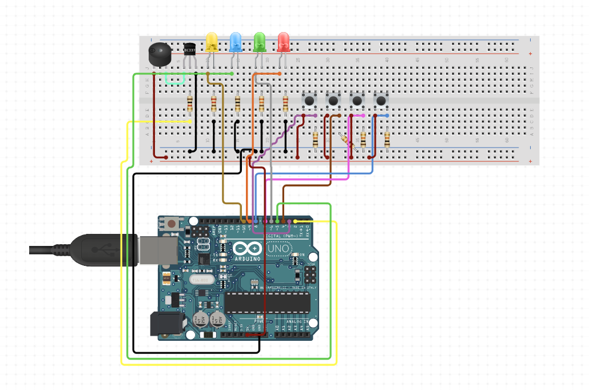

# Rendu Creativ'Lab : SIMON 

> Nous avons décidé de recréer le jeu Simon. Les règles sont simples : reproduisez la séquence d'allumage à l'aide des boutons. A chaque tour, il y aura une lumière de plus dans la séquence, et la démonstration sera plus rapide.

# Schéma

# Explication 

