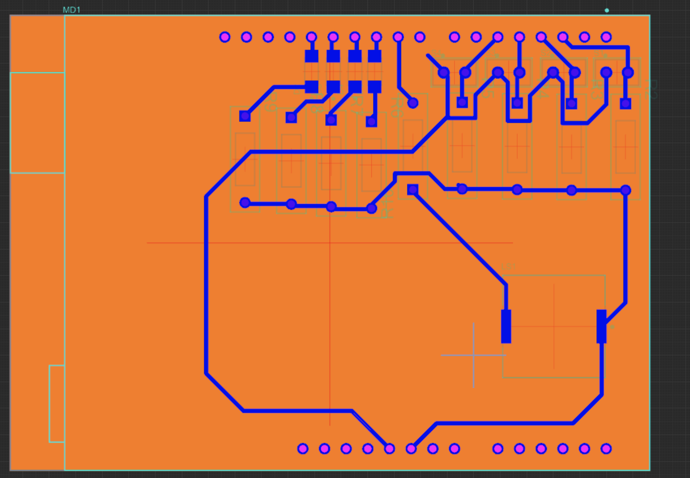

# Rendu Creativ'Lab : SIMON 

> Nous avons décidé de recréer le jeu Simon. Les règles sont simples : reproduisez la séquence d'allumage à l'aide des boutons. A chaque tour, il y aura une lumière de plus dans la séquence, et la démonstration sera de plus en plus rapide.
# Video 

[Lien de la vidéo Youtube](https://youtu.be/6phwVDBONdY)

# Schémas
### Schéma de l'arduino uno

### Schéma de microéléctronique

# Explications
* Chaque bouton est relié à une pin en mode INPUT, ce qui nous permettra de récupérer l'état du bouton
* Chaque led est reliée à une pin en mode OUTPUT, ce qui permettra de l'allumer en envoyant du courant dans le pin
* Un buzzer est relié à une pin en mode OUTPUT, ce qui permettra d'emmettre un son en envoyant du courant dans le pin
